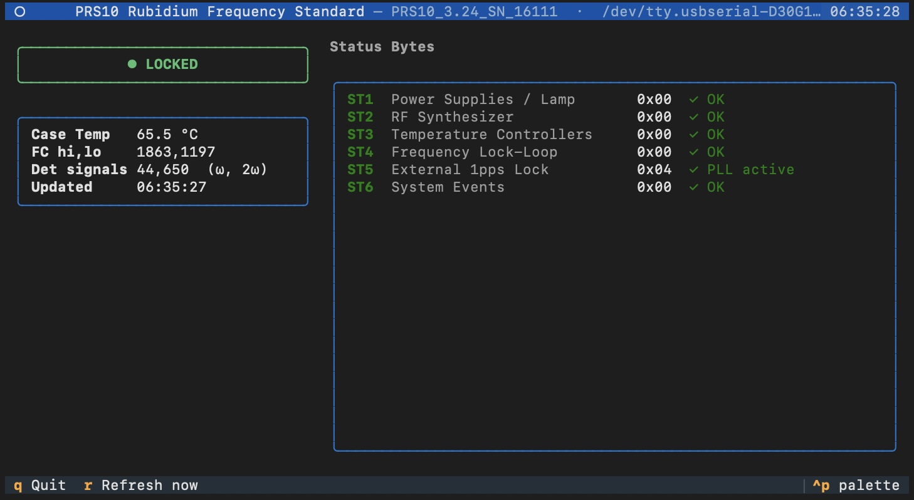

# PRS10 Monitor

A terminal UI for monitoring a [Stanford Research Systems PRS10](https://www.thinksrs.com/products/prs10.html) Rubidium Frequency Standard over RS-232.



## Features

- Live Rb lock status indicator (green / red)
- Case temperature (converted from the onboard 10 mV/°C sensor)
- Frequency control DAC values (hi, lo)
- Detected rubidium signals (ω and 2ω error signals)
- All six status bytes decoded to human-readable fault descriptions
  - Green `✓ OK` when a byte is clear
  - Yellow label + red `⚑` bullets for each active fault
- Configurable poll interval
- Manual refresh at any time with `r`

## Requirements

- Python 3.10+
- A USB-to-RS232 adapter or native serial port wired to the PRS10

Install Python dependencies:

```bash
pip install -r requirements.txt
```

## Usage

```
python3 prs10_monitor.py <device> [interval]
```

| Argument   | Description              | Default      |
|------------|--------------------------|--------------|
| `device`   | Path to the serial port  | *(required)* |
| `interval` | Poll interval in seconds | `5`          |

### Examples

```bash
# Linux / Raspberry Pi
python3 prs10_monitor.py /dev/ttyUSB0

# macOS with a USB-serial adapter
python3 prs10_monitor.py /dev/cu.usbserial-1410

# Poll every 2 seconds
python3 prs10_monitor.py /dev/ttyUSB0 2
```

### Key bindings

| Key | Action      |
|-----|-------------|
| `r` | Refresh now |
| `q` | Quit        |

## Serial settings

The PRS10 RS-232 port is fixed at:

| Parameter    | Value    |
|--------------|----------|
| Baud rate    | 9600     |
| Data bits    | 8        |
| Parity       | None     |
| Stop bits    | 1        |
| Flow control | XON/XOFF |

> **Note:** The PRS10 uses CR-only (`\r`) line endings for both commands and
> responses. The script uses `read_until(b'\r')` rather than `readline()` to
> avoid stalling waiting for a LF that never arrives.

## Status byte reference

| Byte | Subsystem                       |
|------|---------------------------------|
| ST1  | Power supplies & discharge lamp |
| ST2  | RF synthesizer                  |
| ST3  | Temperature controllers         |
| ST4  | Frequency lock-loop             |
| ST5  | External 1 pps lock             |
| ST6  | System-level events             |

A status bit remains set until it is read (i.e. until the next `ST?` query),
even if the fault condition has since cleared. During warm-up it is normal for
ST1–ST4 to show activity.

## Project files

```
prs10_monitor.py   Main script
requirements.txt   Python dependencies
PRS10m.pdf         Stanford Research Systems RS-232 instruction set manual
```
